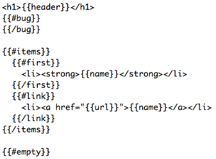
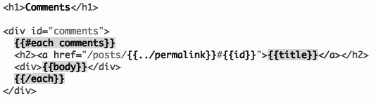
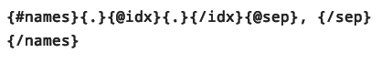

teddy.js
===

Teddy is an easy-to-read, HTML-based, mostly logic-less DOM templating engine with support for both server-side and client-side templating.

It uses new HTML-like `<tags>` for rudimentary templating logic and Teddy Roosevelt's facial hair for `{variables}`.


Why yet another templating engine?
===

Good question.

Here's why:

Funky symbol hell
===

Are you tired of all those cryptic templating systems out there that look like this?



...Or this?



...Or this?



Want something simpler and more readable so you can stop wasting time memorizing what all those funky symbols do and just get work done?

Well you're not the only one.

Teddy, symbol-buster extraordinaire
===

Teddy the trust-buster was a man of the common people, curtailing the abuse of monopolists.

Teddy the templating engine is an engine of the common people, curtailing the abuse of indecipherable templating systems.

Here's how:

- More concise `{variable}` syntax. One curly bracket. Not two, not three, no pound signs, no question marks, no backticks, no gang signs, and no hieroglyphs.
- An `<include>` tag for layout templates and partials which accepts arguments via child `<arg>` elements.
- Flow control tags: `<if>`, `<unless>`, `<elseif>`, `<elseunless>`, and `<else>` for basic templating logic.
- A `<foreach>` tag for looping.
- Server-side `{!comments!}` delimited by exclamation points just like `<!-- HTML comments -->`. Server-side comments are stripped out at the template compilation stage.
- No funky symbols to memorize. Just `{variables}` for data and new HTML-like `<tags>` for rudimentary logic.

Cool, but how exactly do those new tags work?
=

They're real simple. Let's run through them.

Includes
===

Include another template:

```html
<include src='partial.html'></include>
```

Pass arguments to the template:

```html
<include src='partial.html'>
  <arg firstArgument>Plain text argument</arg>
  <arg secondArgument>
    <span>Argument with HTML in it</span>
  </arg>
</include>
```

The arguments you've defined will be accessible as `{firstArgument}` and `{secondArgument}` in the child template `partial.html`.

Conditionals
===

Check for the presence of a variable:

```html
<if something>
  <p>The variable 'something' is present</p>
</if>
<else>
  <p>The variable 'something' is not present</p>
</else>
```

Check a variable's value:

```html
<if something='hello'>
  <p>The variable 'something' is set to 'hello'</p>
</if>
<else>
  <p>The variable 'something' is not set to 'hello'</p>
</else>
```

Check for the non-presence of a variable:

```html
<unless something>
  <p>The variable 'something' is not present</p>
</unless>
<else>
  <p>The variable 'something' is present</p>
</else>
```

An `<if>` statement structure with an `<elseif>` tag which is evaluated if the first `<if>` fails:

```html
<if something>
  <p>The variable 'something' is present</p>
</if>
<elseif somethingElse>
  <p>The variable 'something' is not present, but 'somethingElse' is present</p>
</elseif>
<else>
  <p>The variable 'something' is not present and neither is 'somethingElse'</p>
</else>
```

An `<unless>` statement structure with an `<elseunless>` tag which is evaluated if the first `<unless>` fails:

```html
<unless something>
  <p>The variable 'something' is not present</p>
</unless>
<elseunless somethingElse>
  <p>The variable 'something' is present, but 'somethingElse' is not present</p>
</elseunless>
<else>
  <p>The variables 'something' and 'somethingElse' are both present</p>
</else>
```

One line ifs
===

If you need a more concise conditional just to control which attributes are applied to a given element, then use this syntax:

```html
<p if-something true="class='something-is-present'" false="class='something-is-not-present'">One line if.</p>
```

In that structure, the attribute `if-something` checks to see if the variable `something` is present. If so, the attribute delcared in the `true` attribute is written to the element. If not, the attribute declared in the `false` attribute is written to the element.

Like the `<if>` tag you can check for both the presence of a variable as well as its value. To check the value of a variable, use this syntax:

```html
<p if-something='hello' true="class='something-is-hello'" false="class='something-is-not-hello'">One line if.</p>
```

It's important to note that whichever quotes you use on the outside of your `true` or `false` attributes must be reversed on the inside. So if you use single quotes on the outside, then use double quotes on the inside.

Loops
===

Assume the following JS model:

```js
letters = ['a', 'b', 'c'];
```

It can be iterated over like so:

```html
<foreach val='letter' in='letters'>
  <p>{letter}</p> <!-- outputs a, b, c -->
</foreach>
```

In the above example `in='letters'` defines the JS model being iterated over and `val='letter'` defines a local variable for the current `letter` being iterated over.

When looping over more complex data structures, sometimes you will need access to both the key and the value of your array or object. For instance, suppose this JS model:

```js
names = {jack: 'guy', jill: 'girl', hill: 'landscape'};
```

It can be iterated over like so:

```html
<foreach key='name' val='description' in='names'>
  <p>{name}</p> <!-- outputs jack, jill, hill -->
  <p>{description}</p> <!-- outputs guy, girl, landscape -->
</foreach>
```

We once again define an `in` attribute which we set to `in='names'` and a `val` attribute which we set to `val='description'` similar to the last example. However this time we've iterated over a JS object with named keys instead of a simple indexed array, so it is useful to define a `key` attribute in the `<foreach>` tag to gain access to the name of the current iteration variable. We have defined it as `key='name'` in this example.

Even complex, hierarchical data structures can be iterated over. For instance, suppose this JS model:

```js
objects = [{a:1, b:2, c:3}, {a:4, b:5, c:6}, {a:7, b:8, c:9}];
```

For the above array of objects, we can combine the techniques illustrated above to display each member of the hierarchy in sequence:

```html
<foreach key='i' val='item' in='objects'>
  <p>{i}</p> <!-- outputs 0, 1, 2 -->
  <p>{item.a}</p> <!-- outputs 1, 4, 7 -->
  <p>{item.b}</p> <!-- outputs 2, 5, 8 -->
  <p>{item.c}</p> <!-- outputs 3, 6, 9 -->
</foreach>
```

A complex example combining all tag types
===

Supposing the following JS model again:

```js
objects = [{a:1, b:2, c:3}, {a:4, b:5, c:6}, {a:7, b:8, c:9}];
```

We could perform many complex operations simultaneously. For instance, we could iterate over it with a `<foreach>` and then at each iteration perform an `<if>` statement and `<include>` a partial:

```html
<foreach val='item' in='objects'>
  <if item.a='4'>
    <p>item.a is 4</p>
  </if>
  <p if-item.b='5' true="class='item-b-is-five'" false='hidden'>item.b is 5</p>
  <include src='partial.html'>
    <arg firstArgument>{item.b}</arg>
    <arg secondArgument>
      <span>{item.c}</span>
    </arg>
  </include>
</foreach>
```

Okay, I get it, how can I make my app parse Teddy templates?
===

Teddy can run both as a Node.js module or as a client-side JS library.

Use Teddy in Node.js
===

Teddy is designed for use with <a href='http://expressjs.com/'>Express</a> in Node.

- First require the node modules `http`, `express`, and `teddy`
- Then initialize express and configure it to your liking
- In your express config, make sure to include this line: `app.engine('html', teddy.__express)`

For a complete sample implementation, see the sample app here: <a href='sampleApps/nodeHelloWorld'>sampleApps/nodeHelloWorld</a>

Use Teddy client-side
===

Server-side app:

- Setup a Node.js app using the instructions above
- Precompile templates somewhere in your app using the `teddy.compile('templateName.html')` method
- Create a route that serves one or more precompiled templates as `text/javascript`
- Optionally write the precompiled templates somewhere to disk and serve them as statics instead to optimize for performance

Client-side HTML:

- Include teddy.js: `<script src='teddy.js'></script>`
- Include precompiled templates: `<script src='path/to/precompiled/templates'></script>`
- Include your client.js: `<script src='client.js'></script>`

Writing your client.js:

- Define a model: `var model = {some: 'data'}` or optionally pull the JSON from the server, localStorage, or wherever
- Render a template client-side: `var rendered = teddy.render(teddy.compiledTemplates['template.html'], model)`
- Render the template into the document somewhere, for instance: `document.body.insertAdjacentHTML('beforeend', rendered);`

For a complete sample implementation, see the sample app here: <a href='sampleApps/client-server'>sampleApps/client-server</a>

Notable intentional design choices and limitations 
===

- All variables in Teddy templates are case-insensitive because HTML is case-insensitive.
- Unlike some other templating systems, Teddy will not automatically escape HTML entities contained within variables.
- Teddy adheres to a mostly logic-less templates philosophy. `<if>` and `<unless>` statements in Teddy can only check for a single variable's presence or its precise value. They cannot evaluate complex logic; there are no ands, ors, xors, parentheticals, or math operators. Teddy is of the opinion that complex logic doesn't belong in templates. Evaluate such logic at the code level and pass the results to the templates through the model as readable variables.
- Teddy's browser support and client-side performance is largely tied to how well `DOMParser` and `XMLSerializer` are implemented (if at all) in the target browser.

Client-side browser support
===

Supported desktop browsers:

- Chrome 24+
- Firefox 18+
- Opera 12+
- Internet Explorer 10+
- Safari 6+

Supported mobile browsers:

- Android Chrome 18+
- Android Firefox 18+
- Android 4.0+ default browser
- iOS 5+

Known issues
===

Nothing is perfect, not even <a href='http://www.cracked.com/article_15895_the-5-most-badass-presidents-all-time_p5.html'>the most badass President of all-time</a>.

Any pull requests sent over dealing with any of these outstanding issues will graciously be accepted:

- Client-side dependency `DOMParser HTML extension (polyfill)` requires a patch to function correctly, so a fork had to be included with Teddy. Please encourage @eligrey to merge <a href='https://gist.github.com/kethinov/4760460'>this fork</a> into his gist.
- The unit tests are a bit primitive at the moment. Suggestions for improvement or pull requests with better tests will be much appreciated.
- Source code view on client-side unit tests is broken in IE10 most likely due to a bug in dependency library vkbeautify.

Untested browsers
===

- Android 2.2 and below.
- iOS 4 and below.
- Opera Mini.
- BlackBerry browsers.
- Lots of older versions of the desktop versions of Chrome, Firefox, Opera, and Safari probably work well with Teddy, but there hasn't yet been time to test them. If anyone wants to test them and post the results, it will be greatly appreciated.

Browsers known to be partially broken
===

- Android 2.3's default browser and most likely all prior versions fail the `<title>` and `<style>` tag tests because `doc.documentElement.innerHTML` fails to return the `<head>` tag or its contents. However, if you only intend to use Teddy for partials containing markup fragments rather than full documents, then this bug shouldn't affect you.
- Opera Mobile fails the conditionals overall unit test due to an as yet uninvestigated bug, but all other tests pass. Opera Mobile also has overall terrible performance with Teddy, which may be related.

Browsers known to be totally broken
===

- IE9 is totally broken because IE9's implementation of `DOMParser` sucks and @eligrey's `DOMParser HTML extension (polyfill)` doesn't work in IE9 and below.
- Windows Phone 7's browser: same reason as IE9.
- IE8 and below are totally broken because they have no implementation whatsoever of DOMParser.

Helped wanted!
===

There are many ways to improve Teddy, such as:

- Testing some of the untested browsers.
- Helping to fix some of the things noted above.
- Porting Teddy's JS parser so Teddy templates can be used in other languages, like PHP, Python, Java, etc.
- Submitting pull requests with suggestions for refactoring or performance optimization.

Thanks to any and all who find Teddy useful.

How to run the unit tests
===

Want to hack teddy's code but don't want to break something and cause a regression in the process? Run the supplied unit tests to sanity check existing features.

Start by cloning the git repo:

```
git clone git@github.com:kethinov/teddy.git
cd teddy
```

Install dependencies for the server test:

```
npm install .
```

Run server test:

```
cd unitTests/server
node nodeTests.js
```

To run the client tests, open `unitTests/client/clientTests.html` and follow its instructions.

Dependencies
===

Node.js dependencies:

- <a href='http://nodejs.org/api/fs.html'>fs</a> (bundled with Node.js) - a default Node.js module which provides filesystem access
- <a href='http://nodejs.org/api/path.html'>path</a> (bundled with Node.js) - a default Node.js module which is being used to normalize file paths
- <a href='https://github.com/jindw/xmldom'>xmldom</a> - W3C Standard based (XML DOM Level 2 Core) DOMParser and XMLSerializer for Node.js

Client-side dependencies:

- <a href='https://gist.github.com/eligrey/1129031'>DOMParser HTML extension</a> (code <a href='https://gist.github.com/kethinov/4760460'>forked</a> and bundled) - polyfill for DOMParser parseFromString for certain browsers

Node.js unit test dependencies:

- None

Client-side unit test dependencies:

- <a href='https://code.google.com/p/google-code-prettify/'>prettify.js</a> (bundled) - used to syntax highlight rendered template in unitTests/client/clientTests.html
- <a href='http://www.eslinstructor.net/vkbeautify/'>vkBeautify</a> (bundled) - used to indent rendered template in unitTests/client/clientTests.html

License
===

All original code in Teddy is licensed under the <a href='http://creativecommons.org/licenses/by/3.0/deed.en_US'>Creative Commons Attribution 3.0 Unported License</a>. Commercial and noncommercial use is permitted with attribution.